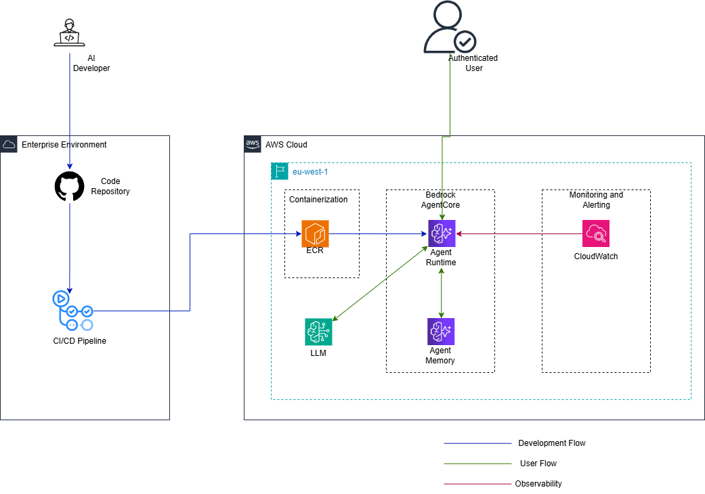

# Teacher Assistant 🧑‍🏫

Teacher Assistant is a multi-agent AI-powered system designeed to assist with eduacational queries. It is built with the [AWS Strands](https://strandsagents.com/latest/) framework and deployed on the [Bedrock AgentCore Service](https://aws.amazon.com/bedrock/agentcore/). The system intelligently routes the user's queries to specialized agents for accurate and contextual responses.

## Architecture ⚙️




It is a multi-agent system with _(at this time)_ three agents including:

- **Orchestrator Agent**: For understanding user intent and coordinating responses from sub-agents.
- **English Agent**: For handling queries regarding the English language.
- **Math Agent**: For handling queries requiring mathematical processes. This agent is equipped with a calculator tool to improve accuracy of responses.

## Prerequisites

- Python 3.14+
- [uv](https://docs.astral.sh/uv/getting-started/installation/) package manager
- AWS Account with Bedrock AgentCore access
- AWS CLI configured with appropriate credentials
- Docker

## Installation

1. Clone the repository:
```bash
git clone https://github.com/Urias-T/teacher-assistant.git
cd teacher-assistant
```

2. Install dependencies using uv:
```bash
uv sync --no-dev
```

## Configuration

### Environment Variables

Create a `.env` file in the root directory with the following variables:

```env
AWS_ACCESS_KEY_ID=<your-access-key>
AWS_SECRET_ACCESS_KEY=<your-secret-key>
REGION_NAME=<your-aws-region>
MEMORY_ID=<your-memory-id>
MEMORY_STRATEGY_ID=<your-memory-strategy-id>
ACCOUNT_ID=<your-aws-account-id>
AGENT_RUNTIME_ARN=<your-agent-runtime-arn>
```

## Project Structure

```
teacher-assistant/
├── docs/
│   └── teacher_assistant_diagram.png
├── infra/
│   ├── deploy_agent.py
│   └── invoke_agent.py
├── memory/
│   ├── __init__.py
│   └── memory.py
├── sub_agents/
│   ├── english_agent/
│   │   ├── __init__.py
│   │   ├── english_agent.py
│   │   └── english_prompt.py
│   ├── math_agent/
│   │   ├── __init__.py
│   │   ├── math_agent.py
│   │   └── math_prompt.py
│   └── __init__.py
├── utils/
│   ├── model_config.py
│   └── __init__.py
├── .dockerignore
├── .env
├── .gitignore
├── .python-version
├── Dockerfile
├── main.py
├── pyproject.toml
├── README.md
├── teacher_prompt.py
└── uv.lock
```

### Setting Up Memory in AgentCore

Before running the system, you need to configure memory in the AWS Bedrock AgentCore service:

1. Navigate to the [AWS Bedrock AgentCore console](https://eu-west-1.console.aws.amazon.com/bedrock-agentcore/home?region=eu-west-1)
2. Go to memory in the sidebar
3. Create a new memory configuration for the Teacher Assistant and select the "Summarization" stragy
4. Copy the generated Memory ID
5. Add the Memory ID to your `.env` file as `MEMORY_ID`
6. Copy the generated Strategy ID
7. Add the Strategy ID to your `.env` file as `MEMORY_STRATEGY_ID`


## Test Locally with Docker 🐋

1. Setup Docker buildx
```bash
docker buildx create --use
```

2. Build Docker image:
```bash
docker buildx build --platform linux/arm64 -t teacher-assistant:arm64 --load .
```

3. Test locally with credentials
```bash
docker run --platform linux/arm64 -p 8080:8080 \
  -e AWS_ACCESS_KEY_ID="$AWS_ACCESS_KEY_ID" \
  -e AWS_SECRET_ACCESS_KEY="$AWS_SECRET_ACCESS_KEY" \
  -e REGION_NAME="$REGION_NAME" \
  -e MEMORY_ID="$MEMORY_ID" \
  -e MEMORY_STRATEGY_ID="$MEMORY_STRATEGY_ID" \
  -e ACCOUNT_ID="$ACCOUNT_ID" \
  teacher-assistant:arm64
```

## Deploy to ECR

1. Create ECR repository
```bash
aws ecr create-repository --repository-name teacher-assistant --region <your-aws-region>
```

2. Login to ECR
```bash
aws ecr get-login-password --region <your-aws-region> | docker login --username AWS --password-stdin <account-id>.dkr.ecr.<your-aws-region>.amazonaws.com
```

3. Build and push to ECR
```bash
docker buildx build --platform linux/arm64 -t <account-id>.dkr.ecr.<your-aws-region>.amazonaws.com/teacher-assistant:latest --push .
```

4. Verify the image
```bash
aws ecr describe-images --repository-name teacher-assistant --region <your-aws-region>
```

## Deploy to Bedrock AgentCore Service 🚀
```bash
uv run infra/deploy_agent.py
```

## Invoke Deployed Agent 🧠
```bash
uv run infra/invoke_agent.py
```

## Contributing 🙌🏽

Contributions are welcome! Please submit pull requests or open issues for any bugs or feature requests.

## License ⚖️

[Add your license information here]

## Support 📧

For issues or questions, please open an issue in the repository or contact me at: triumph@triumphurias.com

## How to Run

🚧 Plans to include more agents are in the works
